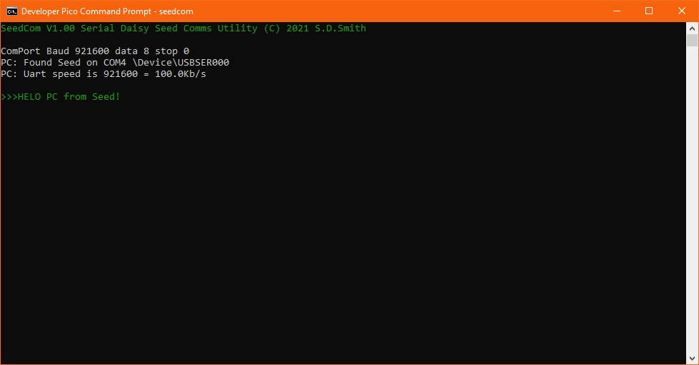
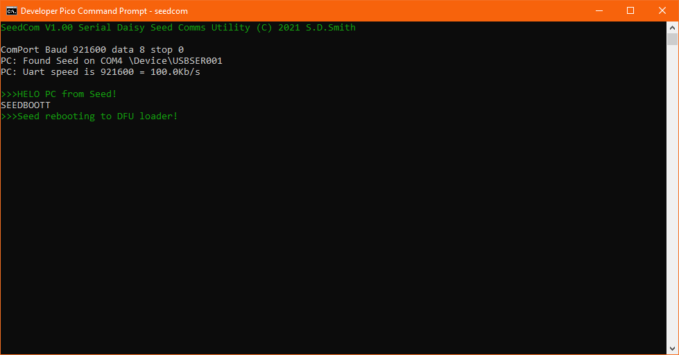
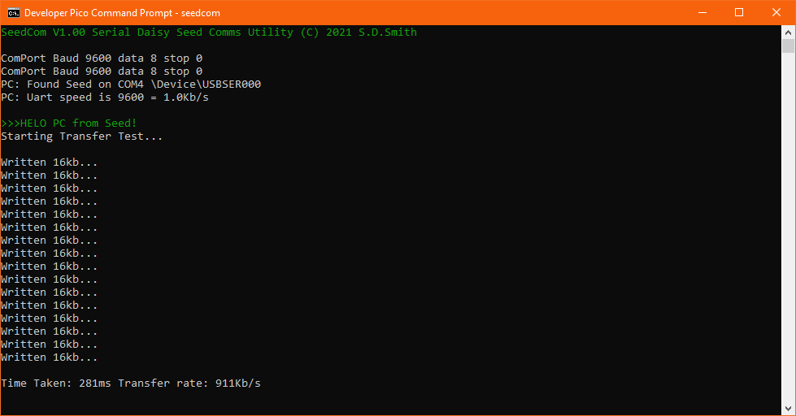

# SeedCom
Serial comms utility for the Electrosmith Daisy Seed

This is a windows command line system.

Seedcom allows you to do a number of things:

1) Upload files to the seeds external flash memory

2) reboot the seed into DFU mode

3) View the files in flash memory

4) View general debug output

## How to install?

1) Make seedcom.exe

type "seedcom.bat" on the commandline - if you have gcc setup this will make the .exe for you

2) copy the libdaisy/core/makefile into your libdaisy/core
this adds new make commands
- REBOOT
- FILE
- 
~~3) Change the internal libs baudrate~~

~~see below "How do I change the transfer speed" - this must be done, else the code won't compile~~

3) Add to your project

add SeedComServer.cpp to your local makefile

```
# Sources
CPP_SOURCES = MyMain.cpp SeedComServer.cpp
```
add SeedComServer.h to your main cpp file

and the two SerialCom functions UartInitSerial and UartShouldReboot  to your main  and main loop.

```
#include "SeedComServer.h"
int main(void)
{
    // HW,Baudrate,GPIO reboot pin
    UartInitSerial(&seed,10000000,14); // 14 is a gpio pin with a switch to GND that will also reboot for you!
    while(1) 
        {
        UartShouldReboot();
        }
}
```
make your project and flash

test it out!

type "Seedcom" on the commandline



type "SEEDBOOT" - it will reboot the seed into DFU mode


## How do I change the transfer speed?

currently it's hardcoded to 115200bps !

and it doesn't seem to make any difference at all changing it




There's a simple transfer speed test built into seedcom. Press x - and it'll
transfer some data to the data and display the transfer speed.

~~\DaisyExamples\libdaisy\src\usbd\usbd_cdc_if.c line 204~~

~~static uint8_t line_coding_fs[7] = { 0x00, 0xC2, 0x01, 0x00, 0x00, 0x00, 0x08 };~~


~~you have to change that line to~~


~~uint8_t line_coding_fs[7] = { 0x00, 0xC2, 0x01, 0x00, 0x00, 0x00, 0x08 };~~


~~so we can easily change the speed in main code~~

~~You change the baudrate to any of these:~~

~~rebuild your libdaisy.a~~

~~\DaisyExamples\Libdaisy\make clean all  (may have to do this twice!)~~

~~then make your project!~~

~~max speed so far is ~~

~~271,658,240bps (29MB/s) - untested - which seems like a bug, and is BONKERS :)~~

~~so that would be 0.027 secs transfer time for the full 8MB - which is clearly insanity.~~


## How do I upload files to flash

create a directory called QFlashZip in your main project folder, put some files in there - images,txt whatever

"make zip" - will zip those files up into a file QFlashData.zip in your build directory

"seedcom build/qflashdata.zip reboot" - will upload the QFlashData.zip to your seed external flash and reboot the seed into DFU mode

## How does this work?

we send txt commands from the PC to seed via serial uart:

- SEEDHELO - seed will return SEEDGOOD
- SEEDBOOT - seed will reboot into DFU mode
- SEEDFILE - seed will expect file info and transfer raw data into external flash (see protocol below)
- SEEDDUMP - seed will list all the files currently in external flash file "QFlashData.zip"
- SEEDMEMO - seed will dump memory usage

The file transfer protocol is:
-	PC sends csv data:
-	FileName,FileSize,FileSize2,CRC32,Type,.....raw file data in 1024 byte chunks....
-	FileName is a standard string - without the null char
- 	FileSize,FileSize2,CRC32 and Type are sent as raw DWORD's

Seed will only receive the file if the CRC is different - this is handy - no need to touch the files and
it saves on time and flash write wear.

Seed will send back SEEDGOOD after every 1024 byte chunk and the final chunk has been received

Seed will send back SEEDFAIL is anything goes wrong or it refuses the file

For the seed - the filename will currently always be "QFlashData.zip"

Currently only supports 1 file in flash, but since it's a .zip file - it contains a whole file system structure
and SEEDDUMP will list all those files inside.

## External Flash Memory Layout

yet to be decided, something like

- Filename[256]
- DateTime String[32]
- FileSize(DWORD)
- Crc32(DWORD)
- RawData(BYTES)
- 
## Build Work Flow
Since we now have a nice comms system, no need to mess around with pressing buttons on the device

```
make zip build/QFlashData reboot flash all
```
will:

- zip up your local "QFLashData" directory
- upload to the seed and write it to external flash memory (only if it has changed)
- reboot the seed into DFU mode
- build your project
- upload your elf and run it

Of course this only works if your seed is running the SerialCommServer, if for some reason your seed crashes - then you'll have to go back to the old button/press method until it is running again.

## TODO

File Transfer code

Flash writing

Zip Loading/Decoding e.t.c.

WatchDog crash/hang into DFU mode

Instrumented Profiling system

